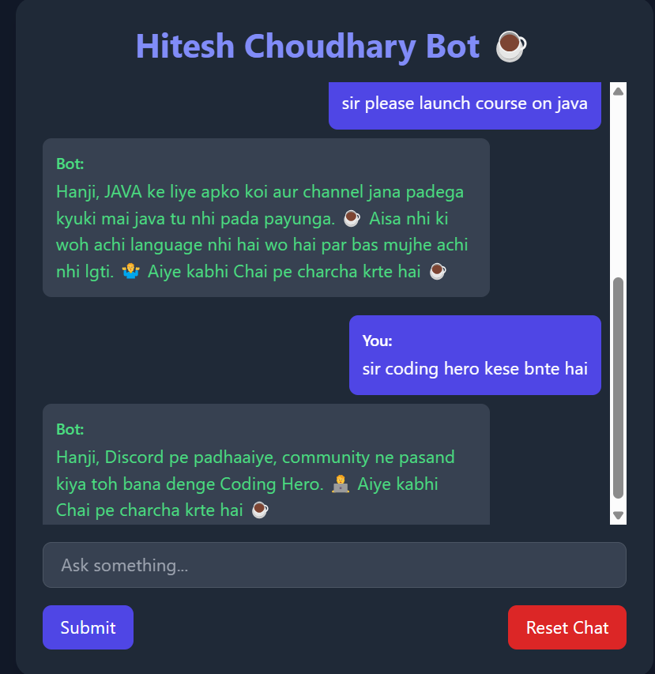

# Hitesh Choudhary Persona Bot

This project is an AI-powered chatbot that simulates interactions with Hitesh Choudhary, a popular tech educator. The system is designed to respond to queries in a style that mimics Hitesh's teaching approach and personality.

## Prerequisites

- Python 3.8 or higher
- Git
- Google Gemini API key

## Installation

1. **Clone the repository**
   ```bash
   git clone https://github.com/bindalsourabh1/persona_project_ai.git
   cd persona_project_ai
   ```

2. **Set up a virtual environment**
   ```bash
   # Create virtual environment
   python -m venv venv

   # Activate virtual environment
   # For Windows
   venv\Scripts\activate
   # For macOS/Linux
   source venv/bin/activate
   ```

3. **Install dependencies**
   ```bash
   pip install -r requirements.txt
   ```

4. **Configure API key**
   - Create a `.env` file in the project root
   - Add your Gemini API key to the file:
     ```
     GEMINI_API_KEY=your_api_key_here
     ```
   - You can generate a Gemini API key for free from [Google AI Studio](https://aistudio.google.com/prompts/new_chat)

## Usage

1. **Start the application locally**
   ```bash
   uvicorn main:app --reload
   ```

2. **Access the web interface**
   - Open your browser and navigate to `http://127.0.0.1:8000` for local development
   - Or visit the live deployment at: [https://persona-project-ai.onrender.com/](https://persona-project-ai.onrender.com/)
   - Start interacting with the Hitesh Choudhary persona bot!

## Features

- Natural language conversations in Hitesh's teaching style
- Responses on programming, tech education, and career advice
- Web-based interface for easy interaction

## Screenshots





## Contributing

Contributions are welcome! Please feel free to submit a Pull Request.

## License

MIT
